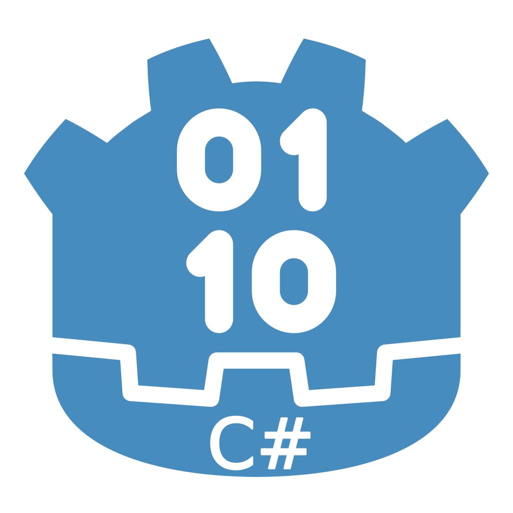

# [Minos UUID Generator](https://minosuuidgenerator.carrd.co) for Godot C# Ver

A UUID generator for [Godot Engine](https://godotengine.org/), with 1.295×10^50 combinations it'll work for any sized game, never having to worry about running out of unique IDs! Automatically stores new UUIDs and removes old ones.

*NOTE: This is for Godot 4 only, and this repo is for C#, click [here](https://github.com/Minoqi/minos-UUID-generator-for-godot) for the GDScript version!*

## Features

- Custom node (UUIDManagerCSharp) that stores the UUID
- Automatically generates UUID when node is created
- Automatically removes UUID when node is deleted
- (Optional) debug messages to make sure UUIDs are always working
- Easily create UUIDs at runtime, just need to instantiate the node and the rest is done automatically

## Installation

Copy the `minos_uuid_generator_csharp` directory into your `res://addons/` directory. Then make sure to enable the plugin in `Project Settings -> Plugins`.

## Documentation
- [Github Ver](Documentation/CSharpDocumentation.md)
- [Website Ver](https://minosuuidgenerator.carrd.co/#docs)

## Contributors

Minos UUID Generator for Godot is made by [Minoqi](https://freelancefelix.com).

## License

Licensed under the MIT license, see `LICENSE` for more information.
